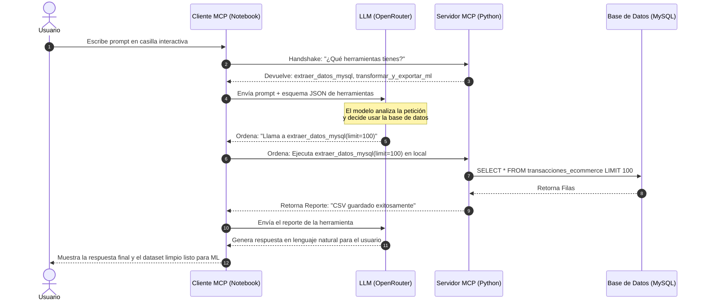

# Plan de Propuestas y Sugerencias: Elevando la Demostración Didáctica de MCP

Este documento contiene un conjunto de **propuestas de diseño educativo e implementaciones técnicas avanzadas** para hacer que la demostración práctica del **Model Context Protocol (MCP)** sea infinitamente más visual, explicativa e interactiva en tu entorno.

---

## 💡 Propuesta 1: El Inspector de Paquetes JSON-RPC (Ver las "Tuberías" en Vivo)

### El Concepto
Por debajo, MCP no es magia: es simplemente un estándar de comunicación que envía mensajes en formato **JSON-RPC 2.0** a través de la consola (`stdio`). 
Actualmente, el cliente y el servidor hablan "en secreto" y tú solo ves el resultado final.

### Cómo Implementarlo
Podemos modificar el cliente en el Notebook para interceptar e imprimir en pantalla los paquetes JSON crudos que viajan por el tubo de comunicación. 

Al correr el pipeline, la consola del notebook mostraría esto en colores:

```json
[CLIENTE OUTBOX] -> Solicitando lista de herramientas...
{
  "jsonrpc": "2.0",
  "method": "tools/list",
  "id": 1
}

[SERVIDOR INBOX] -> ¡Aquí tienes mis herramientas disponibles!
{
  "jsonrpc": "2.0",
  "result": {
    "tools": [
      {
        "name": "extraer_datos_mysql",
        "description": "Extrae transacciones...",
        "inputSchema": { ... }
      }
    ]
  },
  "id": 1
}
```

### Por qué ayuda
Hace que el funcionamiento interno de MCP sea **tangible**. El estudiante o revisor entenderá que la IA no se conecta mágicamente a Python, sino que están intercambiando mensajes JSON estructurados de forma estandarizada.

---

## 🌐 Propuesta 2: Cambiar Transporte `stdio` por `SSE` (Servidor Web con Dashboard de Control)

### El Concepto
Actualmente, usamos `stdio` (entrada y salida de consola en segundo plano). Esto es seguro pero invisible. 
MCP también soporta **SSE (Server-Sent Events)**, lo que significa que el servidor MCP se ejecuta como una API Web real en un puerto (por ejemplo, `http://localhost:8000`).

### Cómo Implementarlo
1. Cambiamos el inicio en `mcp_server.py` a:
   ```python
   mcp.run(transport='sse')
   ```
2. Montamos una mini página web local (HTML + CSS dinámico en Flask/FastAPI) que sirva como **Dashboard de Control de MCP**.
3. En este Dashboard web, el usuario podrá:
   * Ver las bases de datos conectadas en tiempo real.
   * Ver un "Semáforo de Conexión" que brille en verde cuando el LLM invoque una herramienta.
   * Hacer clic en un botón para forzar la llamada de herramientas de forma manual.
   * Ver gráficas en tiempo real del estado de los Rate Limits.

### Por qué ayuda
Convierte un proceso de backend abstracto en una **experiencia visual premium** de cara al usuario final o a evaluadores del proyecto.

---

## 🔀 Propuesta 3: Demostración de Independencia del Modelo (Multi-Client Swapping)

### El Concepto
Uno de los argumentos clave de MCP es: *" Escribe el código de tus herramientas una sola vez y úsalo con cualquier modelo"*.

### Cómo Implementarlo
En el notebook, podemos crear una celda interactiva con un menú desplegable (usando `ipywidgets` en Jupyter o controles interactivos de Databricks) para seleccionar con qué cerebro de IA queremos trabajar:
* 🟢 **Opción A:** Nvidia Nemotron-3 (Vía OpenRouter)
* 🔵 **Opción B:** Google Gemini 1.5 Pro (Vía SDK oficial de Google)
* 🔴 **Opción C:** Claude 3.5 Sonnet (Vía Anthropic)

### Por qué ayuda
Demuestra en la práctica la portabilidad de MCP. Ver que puedes cambiar el cerebro de la IA con un clic, pero que **el código de conexión a MySQL del servidor sigue siendo exactamente el mismo**, es el momento "¡Ajá!" definitivo para entender el valor del protocolo.

---

## 📊 Propuesta 4: Diagrama de Flujo Interactivo (Mermaid) integrado en el Notebook

### El Concepto
Integrar un diagrama dinámico de arquitectura dentro de las celdas Markdown del Notebook para que el usuario pueda mapear mentalmente qué componente está hablando con cuál en cada paso.



---

### Siguientes Pasos Recomendados:
Si te convence alguna de estas ideas (especialmente la **Propuesta 1 del log de paquetes JSON-RPC** o la **Propuesta 3 de Multi-Client**), dímelo y la implementaremos de inmediato en tu código base para hacerlo súper robusto y explicativo.
